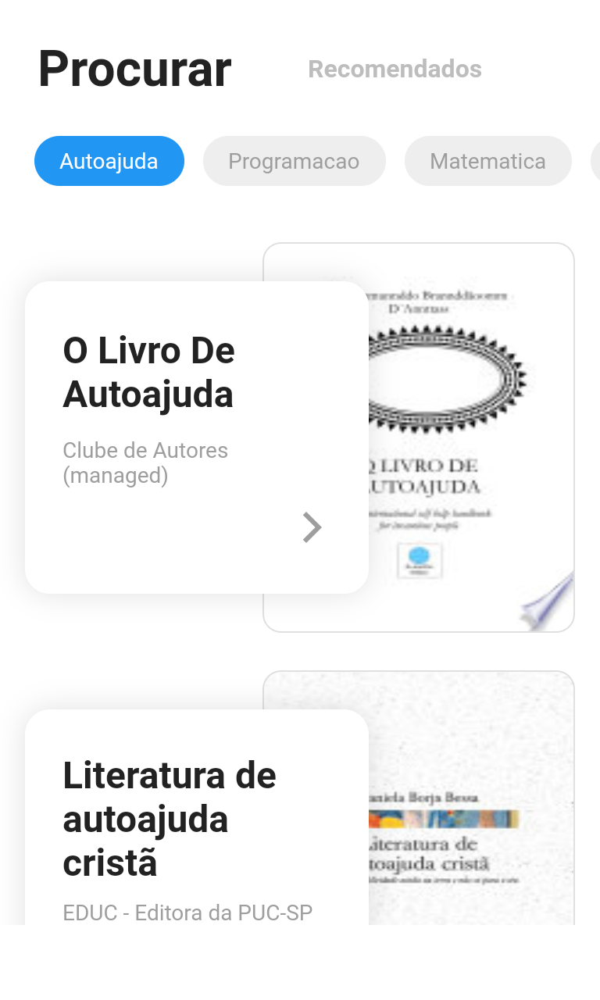
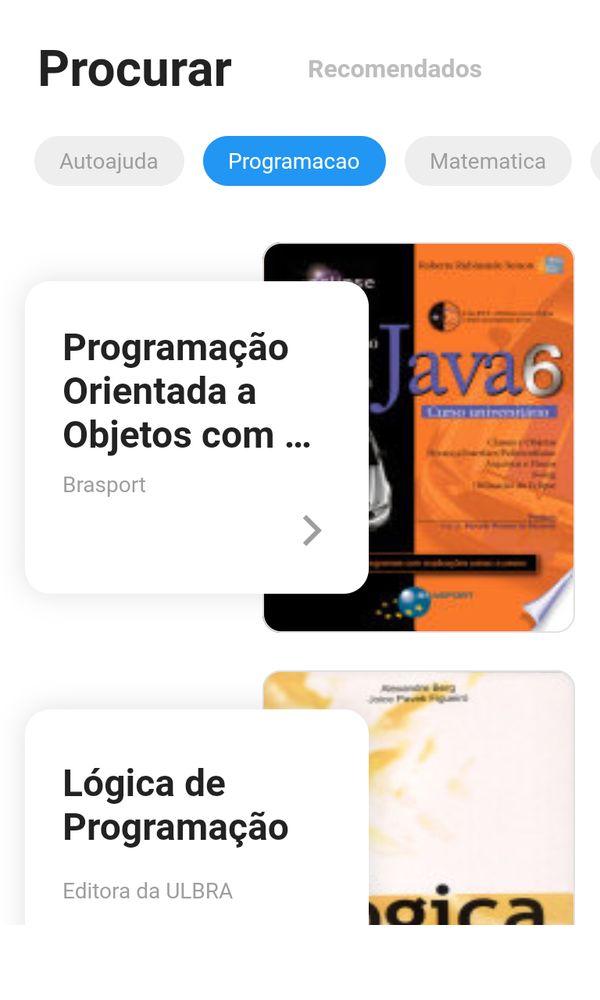
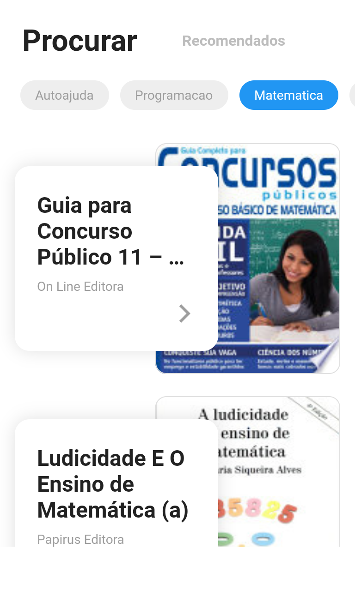

# Flutter Livros

Aplicação para busca de livros utilizando a API do Google Books, desenvolvida para estudos de Flutter e BLoC Libary.

## Prévia

|                              |                              |                              |                              |
| :--------------------------: | :--------------------------: | :--------------------------: | :--------------------------: |
|  |  |  |  |
|                              |                              |                              |                              |

## TODO

-

## Tecnologias utilizadas

- Dart
- Flutter
- http
- BLoC Libary
- Equatable
- Meta
- Visual Studio Code
- Genymotion
- KDE neon e ❤

## Referências

- [Flutter Documentation](https://flutter.dev/docs)
- [Bloc](https://bloclibrary.dev/)
- [Pedro Massango](https://bit.ly/2TaRHTG)

Inspirado na série de vídeos do Pedro Massango sobre Flutter e Bloc, muito obrigado :)
